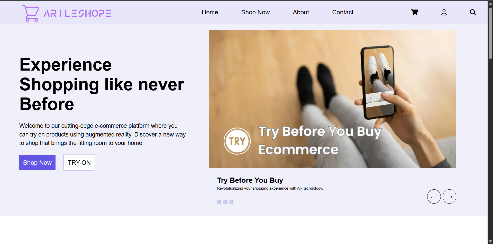
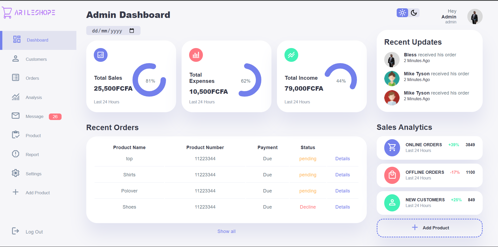

# 🛍️ AR E-Commerce Platform

An advanced **E-commerce web application** built with **Laravel** that integrates **Augmented Reality (AR) Try-On** to enhance the user shopping experience. Customers can virtually try on clothes using their camera before making a purchase.

---

## 🔍 Preview




> 📷 Replace `preview.png` with your actual image filename in the repo folder.

---

## 🚀 Features

- 🛒 **Full E-commerce Functionality**
  - Product listings, categories, cart, checkout, and order history
- 👗 **AR Try-On Integration**
  - Uses Web AR to overlay clothing items on live camera feed
- 👤 **User Authentication**
  - Register/Login with role-based access (Admin, Customer)
- 📦 **Product Management**
  - Admin CRUD operations for products, categories, users
- 📈 **Order Tracking & Management**
  - Real-time order updates and admin control
- 📱 **Responsive UI**
  - Optimized for desktop, tablet, and mobile views

---

## 🧠 How the AR Try-On Works

1. User clicks "Try On" on a product.
2. Camera opens via WebAR (e.g., Three.js or WebXR).
3. Clothing image is overlaid in real time.
4. User can view themselves wearing the item before buying.

---

## 🛠️ Tech Stack

| Technology | Purpose |
|------------|---------|
| **Laravel** | Backend API & Web framework |
| **Blade** | Frontend templating |
| **MySQL** | Database |
| **HTML, CSS, JS** | UI |
| **Three.js / WebXR** | AR Integration |
| **Bootstrap/Tailwind** | Styling |
| **Rembg + Depth Estimation** | (Optional) Clothing 3D mesh generation |

---

## ⚙️ Installation & Setup

```bash
# 1. Clone the repo
git clone https://github.com/yourusername/ar-ecommerce.git

# 2. Navigate into the project
cd ar-ecommerce

# 3. Install dependencies
composer install
npm install && npm run dev

# 4. Setup environment
cp .env.example .env
php artisan key:generate

# 5. Configure your DB in .env, then:
php artisan migrate --seed

# 6. Start the server
php artisan serve
